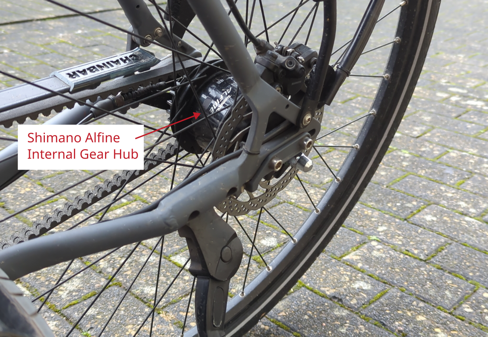
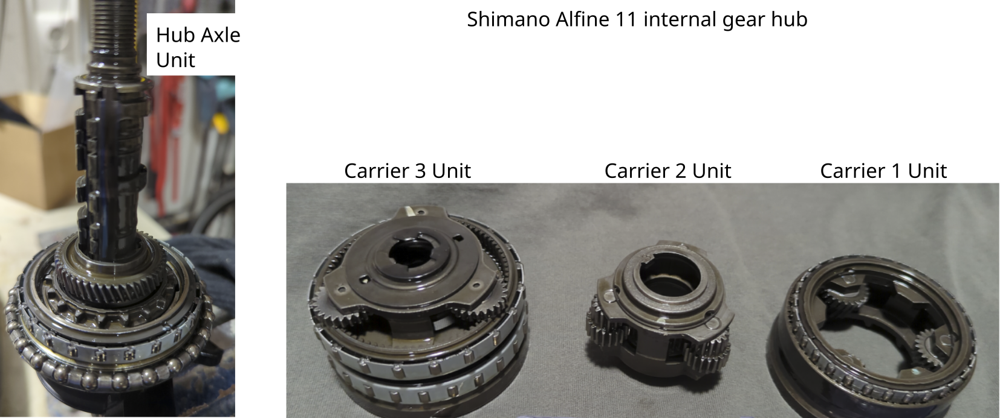
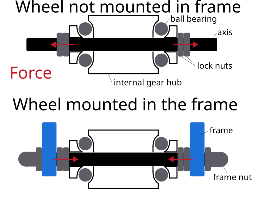

# Shimano Alfine 11 internal gear hub feels like braking

Manufacturer: `Shimano`    
Type: `Alfine SG-S7001-11`

## Description of failure
The bike with the gear hub feels like it is being braked. 
Even short distances of, say, 5 km feel more like cycling 15 km. 
If you simply let the lifted rear wheel spin with your hand, it will stop after a short time. 
On comparable bikes, the rear wheel spins for significantly longer.
This bicycle has been riding like this since it was purchased new.

## Failure investigation
First, check whether the belt tension is correct. 
There is an app for android / iOS to check the tension.
Adapt the belt tension, if needed.
The Shimano manual points out two different suggestions
 * Internal defect of gear hub, and
 * the cone of the wheel is tightened too firmly and blocks the bearings. 

First, it should be checked if there is any damage on the internal gear hub.
Details should be checked according to [Radambulanz](https://radambulanz.de/fahrrad-themen-alfine-11-gang-zerlegen.html).
The following image shows the disassembled gear hub. 
Care should be taken to ensure cleanliness so that no dirt enters the interior of the hub during reassembly.
The gears should be checked for broken corners and irregularities. 
In general, with a little skill, the hub is easy to disassemble and reassemble.

Second, the [Shimano service manual](https://si.shimano.com/de/pdfs/sm/IHG-INTER11/SM-IHG-INTER11-003-GER.pdf) states that the cone lock nut should be adjusted so that the wheel can be turned easily, but there should be no bearing clearance. 
If the bearing clearance is adjusted as described (without bearing clearance), the wheel can still be turned easily, but no longer smoothly when the wheel is mounted on the bike.
Without the frame mounted, the force pushes outward and the bearing balls can move freely. 
When the frame is mounted, an additional force is exerted on the balls despite the lock nuts, which further reduces the previously non-existent bearing clearance.

At this point, it must be clearly stated that a slight amount of bearing clearance (not mounted in frame) must be allowed in order for the wheel to turn smoothly when mounted in frame. 
Even if it seems to make little difference, this small difference is important!
The wheel must then be re-installed in the frame to check whether it still turns smoothly when screwed in place. 
If necessary, the adjustment process must be repeated iteratively.

After approximately 6 months with minimal bearing clearance, no oil loss could be detected at the hub.
But the bike rides very well again.
