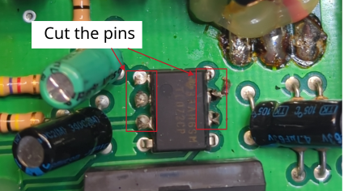
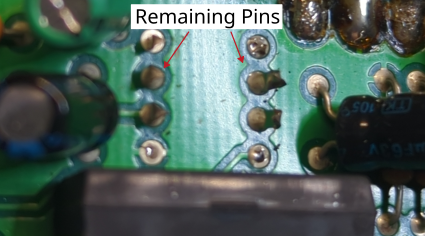
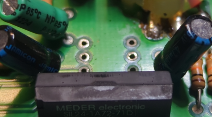

# Successful desoldering of an IC with multiple pins

## Description of failure
A defective IC must be replaced. 
The challenge is to remove the defective component, which will be described in this article.

## Procedure for desoldering
The goal is to desolder the component with multiple pins in order to insert a new component. 
The old component will be destroyed in the process, as it is already defective. 
The instructions can be followed using standard tools; no special aids (such as special soldering tips) are required.

**1. Cut the pins from the component**     
Since not all pins can be heated at the same time to remove the component, the individual pins on the component are cut off. 
It makes sense, for example, not to cut off two pins, as the these pins can then be pulled out together with the component in the next step.

**2. Remove the component**      
First, one pin is heated and the component is pulled out of the through-hole by tilting it. 
Then the second pin is heated and the component is removed completely.

**3. Remove the Pins**     
The remaining pins that are still stuck in the circuit board are removed with pliers while heating. 
This is done separately for each pin, what can be done easily using standard tools.

**4. Remove the solder from the pin holes.**     
By using solder wick.

The next figures shows removed component and the removed component pins from the PCB.

