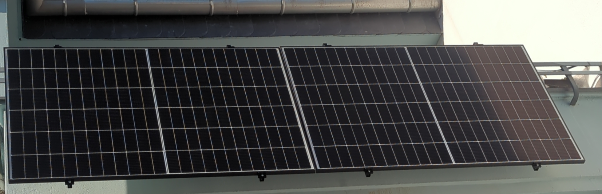
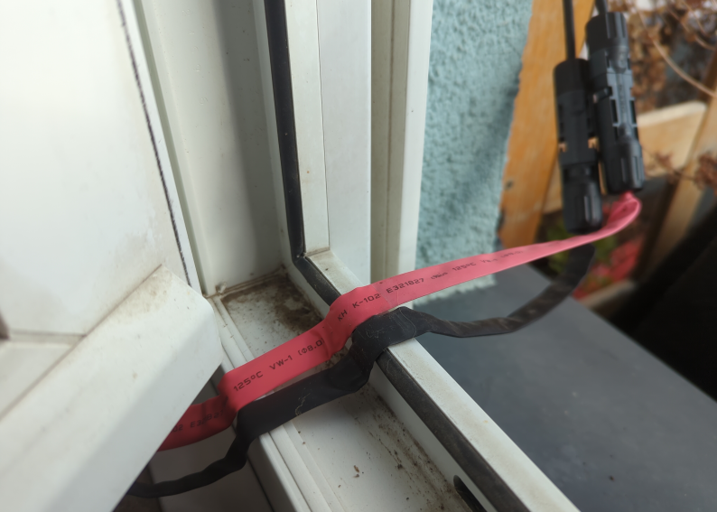

# Plug-in-solar-panels

## Motivation
Balcony solar panels are becoming increasingly popular as they contribute significantly to reducing electricity costs.
Installation costs are manageable, at just a few hundred euros, and the systems pay for themselves within a few years, after which they contribute significantly to reducing electricity costs.
Furthermore, they are easy to install and do not require a professional. 

## Implementation 
Complete sets can be purchased online. 
It’s a bit cheaper if you put the set together yourself. 
Solar panels are often sold through online marketplaces, where you can choose to pick up individual panels directly from the seller. 
This saves on shipping costs. 
However, you should take the panels’ large dimensions into account. 
You’ll need either roof racks or a very large trunk.
If you need DC extension cords, you can find them at a hardware store. 
Depending on the type of balcony, you’ll need to find suitable brackets. 
There’s a wide variety of brackets available, just use your favorite search engine.

## Costs (as of April 2026)
Currently, solar components for private use are tax-free (germany).
 * PV panel approx `60 €` per `450 W` panel
 * Inverter `800 W` incl. AC connection cable approx. `115 €`
 * DC extension cords (if required), approx. `10 € ... 20 €`
 * Balcony mounts, depends on the balcony. In best case approx. `30 €` per module, but can also be more expensive

Some cities even offer subsidies for plug-in solar panels. 
This can help you save even more money. 
Be sure to look into this. 
But even without a subsidy, such a system is still a worthwhile investment!

## FAQ

### What if I don't have an outdoor outlet?
There are cable bushings for DC cables designed for windows. 
These are routed through the closed window. 
Make sure to route the cable through a window that isn't opened very often. 
You should also take the maximum current-carrying capacity into account.
